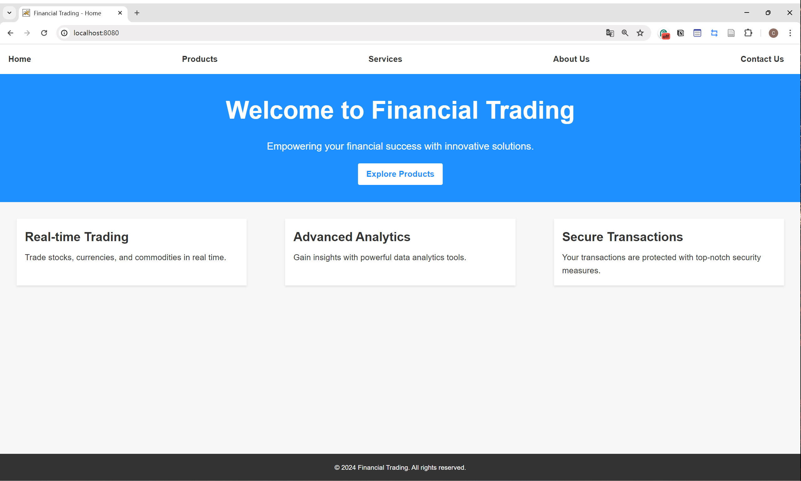
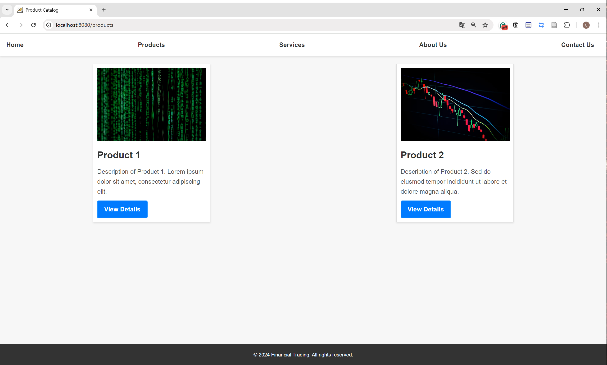
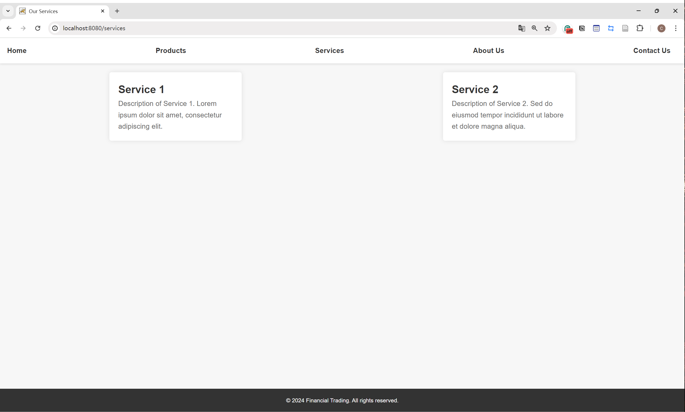
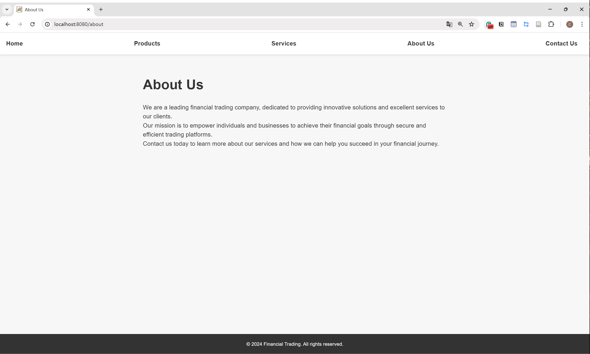
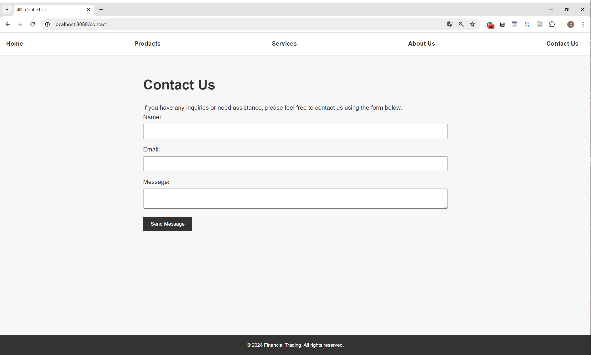

# Financial Trading Demo

<div align="center">
  <a href="">
    
  </a>
</div>

A simple financial platform demo built using Spring MVC, demonstrating basic products and user interactions without database integration.

## Built With

- Spring Boot
- Thymeleaf
- HTML/CSS
- Maven

## Getting Started

1. Make sure you have Java and Maven installed.
2. Clone or download the project to your local machine.
3. Navigate to the project root directory in the command line.
4. Use the following command to start the project:

  ```
  mvn spring-boot:run
  ```
5. Access the project in your browser at [http://localhost:8080](http://localhost:8080).

## Page Previews

### Home Page

<div align="center">
  <a href="">
    
  </a>
</div>

### Products Page

<div align="center">
  <a href="">
    
  </a>
</div>

### Services Page

<div align="center">
  <a href="">
    
  </a>
</div>

### About Us Page

<div align="center">
  <a href="">
    
  </a>
</div>

### Contact Us Page

<div align="center">
  <a href="">
    
  </a>
</div>